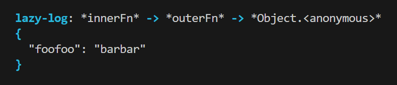

# scope-logger

# What it does

Logs a variable and a sequence of scopes through which it's accessed. It automatically logs the name of the variable.

# Why??

Too lazy to write `console.log("variableName %o", variableValue)` :)
The same effect can be achieved with `console.log({variable})` => `$ variableName: variableValue`
But this logger shows the sequence of scopes (i.e., functions) from the variable is logged, a feature that I wished I had when I was logging many different variables.

# Example

```javascript
function outerFn() {
  function innerFn() {
    const logger = new Logger("lazy-log");

    const foofoo = "barbar";
    logger.log({ foofoo });
  }

  innerFn();
}

outerFn();
```

    Output:
    

# How to install

`$ npm install scope-logger`

# How to log

1. Create an instance of `Logger`. Namespace and options are optional args for constructor.

2. Pass the variable you want to log to the `log` method inside **curly brackets** `{}`!
